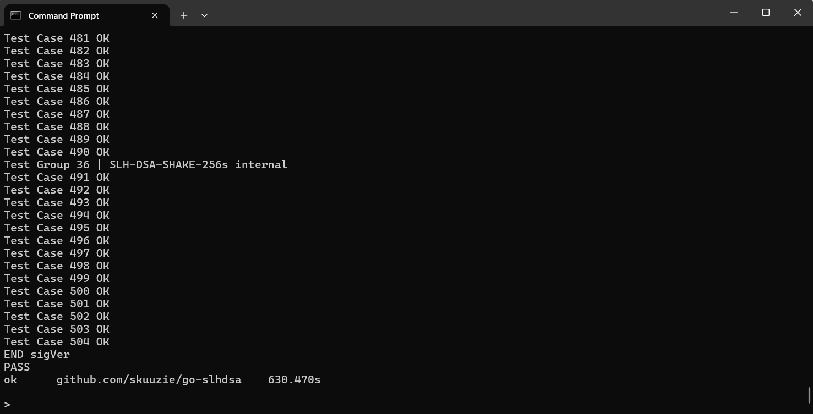

# SLH-DSA (FIPS 205)

Go language implementation of Stateless Hash-Based Digital Signature Standard based ([FIPS 205](https://csrc.nist.gov/pubs/fips/205/final))

Demo: https://deeon-slhdsa.vercel.app/

---

1. [Installation](#installation)
2. [Quick Start](#quick-start)
3. [Internals](#internals)
4. [Examples](#examples)

---

# Installation

```bash
go get github.com/skuuzie/go-slhdsa
```

# Quick Start

```go
ctx, _ := slhdsa.New(slhdsa.ParameterSet.SLHDSA_SHAKE_128s)

sk, pk, _ := ctx.GenerateKeyPair()
m := []byte("Test")
context := []byte("lalalala")

sig, _ := ctx.GenerateSignature(sk, m, context, false, slhdsa.PreHashAlgorithm.Pure)
fmt.Println(ctx.VerifySignature(pk, m, sig, context, slhdsa.PreHashAlgorithm.Pure))
```

# Internals

Internal functions are faithfully implemented from FIPS 205, utilizing big int for every integer ops.

Testing is fully validated by data from ACVP.



# Examples

Check out other example that includes:
1. Context string usage
2. Additional randomness usage
3. Prehashing
4. Compilation to WebAssembly